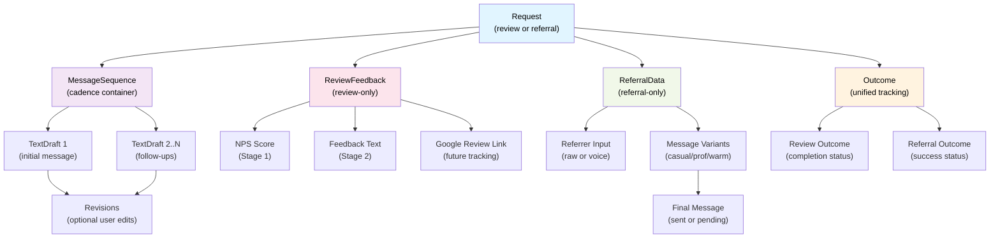

# Data Structure & UI Organization

## Core Data Model Overview

This document outlines the hierarchical data structure for Requests, Messages, Feedback, and Referral tracking in Rave, along with how these structures map to UI screens and user workflows.

---

## Entity Relationship Flowchart



---

## Data Structures (TypeScript)

### 1. Request (Root Entity)

```typescript
interface Request {
  id: string;
  type: "review" | "referral";
  contactId: string;
  contactSnapshot?: {
    displayName: string;
    avatarUrl?: string;
    initials?: string;
  };
  ownerId: string;
  createdAt: Date;
  status: "new"
    | "requested"
    | "feedback-received"
    | "reviewed"
    | "replied"
    | "referral-drafted"
    | "introduced"
    | "thanked";
  
  // Core content
  messageSequence: MessageSequence;
  
  // Nested tracking (type-specific)
  feedback?: ReviewFeedback;        // Only for review requests
  referralData?: ReferralData;      // Only for referral requests
  outcome?: Outcome;
  
  // Metadata
  tags?: string[];                   // For filtering/organization
  actionRequired?: boolean;        // True only when an owner-facing next action exists now
  archivedAt?: Date;
}
```

**Purpose**: Top-level container for a single request to a contact. Ties together all messages, feedback, and outcomes.

---

### 2. MessageSequence (Cadence Container)

```typescript
interface MessageSequence {
  id: string;
  stage: 1 | 2;                      // Stage 1 = NPS feedback, Stage 2 = nudge to Google/finalize
  messages: TextDraft[];             // Chronological array
  cadenceSettings: {
    intervalDays: number;            // Days between follow-ups
    maxAttempts: number;             // Max messages in this sequence
    lastMessageSentAt?: Date;
    nextScheduledAt?: Date;
  };
}
```

**Purpose**: Manages the sequence of messages for a single request. Handles scheduling, ordering, and stage progression (Stage 1 → Stage 2 based on feedback).

---

### 3. TextDraft (Individual Message)

```typescript
interface TextDraft {
  id: string;
  sequenceId: string;
  orderInSequence: number;           // 1 = initial, 2+ = follow-ups
  content: string;
  generatedAt: Date;
  sentAt?: Date;
  status: "unsent" | "sent" | "archived";
  
  // Revision tracking
  revisions?: {
    originalContent: string;
    userRevisions: string[];         // User edits via "Revise" action
    aiRevisions: string[];           // AI-polished versions
  };
  
  // Channel & context
  channel: "sms" | "email";
  metadata?: {
    customContext?: string;          // Voice dictation or typed context
  };
}
```

**Purpose**: Represents a single message in a sequence. Stores content, send status, and revision history. Kept separate from feedback so message history remains clean.

---

### 4. ReviewFeedback (Review Request Only)

```typescript
interface ReviewFeedback {
  id: string;
  requestId: string;
  
  // Stage 1: NPS Score (NPS feedback form)
  npsScore?: {
    value: 0 | 1 | 2 | 3 | 4 | 5 | 6 | 7 | 8 | 9 | 10;
    submittedAt: Date;
    meetsThreshold: boolean;        // Compared against owner's threshold setting
    category: "promoter" | "passive" | "detractor";  // 9-10: promoter, 7-8: passive, 0-6: detractor
  };
  
  // Stage 2: Feedback Text (only if NPS ≥ threshold)
  feedbackText?: {
    text: string;                    // User's own feedback text
    submittedAt: Date;
    userCopiedToClipboard?: boolean;
    googleReviewSubmitted?: boolean;
  };
  
  // Future: Auto-detection of Google review
  linkedGoogleReview?: {
    googleReviewId: string;
    confirmedAt: Date;
  };
}
```

**Purpose**: Captures the two-stage feedback flow:
- Stage 1 gathers NPS score (0–10 scale: "How likely are you to recommend [business] to a friend or colleague?")
- Stage 2 (if threshold met) captures user's feedback text for copying to Google
- Tracks Google review completion when available

---

### 5. ReferralData (Referral Request Only)

```typescript
interface ReferralData {
  id: string;
  requestId: string;
  
  // Who and what
  referrerId: string;                // Contact who will make the intro
  targetContactIds: string[];        // Who the intro is being made to
  
  // Stage 1: Referrer's Raw Input
  referrerInput?: {
    rawInput: string;                // What referrer said/typed
    inputMethod: "voice" | "text";
    submittedAt: Date;
  };
  
  // Stage 2: Variants & Customization
  messageVariants?: {
    variants: {
      tone: "casual" | "professional" | "warm";
      text: string;
      generatedAt: Date;
    }[];
    selectedVariant: "casual" | "professional" | "warm" | "custom";
    customMessage?: string;          // If user chose custom tone
    customizationContext?: string;   // One-sentence user addition for surgical revision
    finalMessage: string;            // What will actually be sent
  };
  
  // Send tracking
  sentAt?: Date;
}
```

**Purpose**: Manages the referral request lifecycle:
- Captures referrer's raw input (voice or text)
- Generates three tone variants (casual, professional, warm)
- Allows one-sentence surgical customization ("Make this sound more like me")
- Locks the final message for sending

---

### 6. Outcome (Unified Tracking)

```typescript
interface Outcome {
  id: string;
  requestId: string;
  
  // Review-specific outcome
  reviewOutcome?: {
    completed: boolean;
    googleReviewSubmitted: boolean;
    submittedAt?: Date;
  };
  
  // Referral-specific outcome
  referralOutcome?: {
    introSuccessful: boolean;
    markedByUserAt?: Date;
    noteFromUser?: string;
  };
  
  // General tracking
  abandonedAt?: Date;
  abandonReason?: string;
}
```

**Purpose**: Unified container for tracking whether a request reached its goal. Separate from message and feedback data to keep concerns clean.

---

## Derived Metrics (Scorecard)

The scorecard is computed from existing Request data. It is **read-only**, time-filtered, and excludes archived requests.

### Metric Rules (from prototype)
- **Review Requests** = count of review Requests with `status !== "new"`.
- **Reviews** = count of review Requests with `status ∈ {"reviewed","replied"}`.
- **Referral Requests** = count of referral Requests with `status !== "new"`.
- **Intros** = count of referral Requests with `status ∈ {"introduced","thanked"}`.
- **Conversion** = completed / requests (rounded to whole percent).
- **NPS Score** = calculated from ReviewFeedback.npsScore values:
  - **Promoters** (9–10): count of NPS scores ≥ 9
  - **Passives** (7–8): count of NPS scores 7–8
  - **Detractors** (0–6): count of NPS scores ≤ 6
  - **NPS** = % Promoters - % Detractors (standard NPS calculation)
  - **Average NPS** = mean of all NPS scores (0–10)

### Time Filtering
- The time window applies to the **request sent date** (not draft creation).
- Recommended source:
  - `requestedAt` (persisted), or
  - First `TextDraft.sentAt` in `messageSequence.messages` (derived).
- Requests with no sent timestamp are excluded from scorecard counts.

### Suggested Aggregate Shape
```typescript
type ScorecardRange = "last-7" | "last-30" | "last-90" | "all-time" | "custom";

interface ScorecardFilters {
  range: ScorecardRange;
  startDate?: Date;   // required when range = "custom"
  endDate?: Date;     // required when range = "custom"
  includeArchived?: false; // scorecard default = false
}

interface ScorecardMetrics {
  reviews: {
    requests: number;
    completed: number;
    conversionPercent: number;
  };
  referrals: {
    requests: number;
    completed: number;
    conversionPercent: number;
  };
  nps: {
    totalResponses: number;
    promoters: number;        // Scores 9–10
    passives: number;         // Scores 7–8
    detractors: number;       // Scores 0–6
    npsScore: number;        // % Promoters - % Detractors (-100 to +100)
    averageScore: number;    // Mean of all NPS scores (0–10)
  };
}
```

---

## UI Organization Strategy

### Screen Hierarchy

#### 1. **Requests List** (Primary Screen)

The main hub showing all active requests at a glance.

**Layout**:
- **Header**: Filters/tabs
  - All Requests
  - Review Requests
  - Referral Requests
  - Archived

- **Request Cards** (one per Request):
  - Contact name + avatar
  - Request type badge (Review | Referral)
  - Action indicator:
    - If a next action exists for the owner (send message, reply on Google, or request a referral), show a small **Action Needed** badge
    - These cards should bubble to the top of the list
    - Users can delete the next action to clear the badge
  - Status indicator:
    - ⚪ **Requested** – message sent, no action yet
    - 🟡 **Responded** (Feedback/Referral Received) – internal step done
    - ✅ **Completed** (Reviewed/Introduced) – final goal met
  - Last message preview (truncated) + timestamp
  - Quick action buttons: **Expand** | **Archive**

**Data from**:
- Request.status
- Request.contactSnapshot (or contactId to hydrate name/avatar)
- Request.messageSequence.messages[last]
- Request.feedback (if review)
- Request.referralData (if referral)
- Request.outcome

---

#### 2. **Request Detail** (Modal/Expanded View)

Expanded view showing the next action and a history timeline only.

**Structure**:

```
┌─────────────────────────────────────┐
│ Request Header                      │
│ Contact: Jane Doe | Type: Review    │
│ Status: Awaiting Feedback           │
│ Created: Jan 10, 2026               │
└─────────────────────────────────────┘

┌─────────────────────────────────────┐
│ Next Action                          │
│ ┌─────────────────────────────────┐ │
│ │ Text Message / Reply on Google  │ │
│ │ "Just checking in..."           │ │
│ │ [Send] [Revise] [Delete]        │ │
│ └─────────────────────────────────┘ │
└─────────────────────────────────────┘

┌─────────────────────────────────────┐
│ History                              │
│ • Message Sent                      │
│ • Feedback Received                 │
│ • Google Review Posted              │
└─────────────────────────────────────┘
```

**Sections**:
- **Next Action** – Single card at the top. This can be a text message, a Google reply, or a referral request.
- **History** – Collapsible list of everything that already happened (messages, feedback, review posted, referrer input, intro sent).

**Data from**:
- Request.messageSequence
- Request.feedback (if review)
- Request.referralData (if referral)
- Request.outcome

---

#### 3. **Message Revision Modal**

Inline or modal interface for revising a draft message.

**Flow**:
1. User taps **[Revise]** on a TextDraft card
2. Modal opens showing current draft text
3. User can:
   - Type new text in text input field, OR
   - Tap **[Dictate]** to use Swift voice widget
4. User taps **[Revise]** button
5. Spinner shows while AI polishes the message
6. Revised text replaces draft in the modal or inline
7. User can iterate or tap **[Send]** or **[Done]**

**Data stored**:
- TextDraft.revisions.userRevisions (raw edits)
- TextDraft.revisions.aiRevisions (polished versions)
- TextDraft.content (final version)

---

#### 4. **Drafts Hub** (Dedicated Section)

Centralized view of all TextDrafts across all requests (from features.md).

**Tabs**:
- **Unsent** – Drafts ready to send or revise
- **Sent** – History of dispatched messages (read-only unless copy/resend)
- **Archived** – Hidden messages (retrievable)

**Card Layout** (for each TextDraft):
- Request context (contact name, request type)
- Message preview (truncated)
- Status indicator
- Timestamp
- Swipe/long-press actions: **Delete** (permanent) or **Archive**

**Data from**:
- All TextDraft objects filtered by status

---

#### 5. **Referral Variants Screen** (Referral Only)

When a referrer submits their raw input, show three ready-to-send variants.

**Layout**:
```
┌─────────────────────────────────────┐
│ Choose a tone for your intro:       │
├─────────────────────────────────────┤
│ ┌─────────────────────────────────┐ │
│ │ 😄 CASUAL                       │ │
│ │ "Hey Alex — looping you in..." │ │
│ │ [Select] [Customize]            │ │
│ └─────────────────────────────────┘ │
│ ┌─────────────────────────────────┐ │
│ │ 💼 PROFESSIONAL                 │ │
│ │ "Hi Alex — I wanted to intro..." │ │
│ │ [Select] [Customize]            │ │
│ └─────────────────────────────────┘ │
│ ┌─────────────────────────────────┐ │
│ │ 🤝 WARM                         │ │
│ │ "Hey Alex! This is Jamie..."    │ │
│ │ [Select] [Customize]            │ │
│ └─────────────────────────────────┘ │
└─────────────────────────────────────┘
```

**Actions**:
- **[Select]** on any variant → Preview & Send screen with that tone
- **[Customize]** → "Make this sound more like me" modal (one-sentence context)

**Data stored**:
- ReferralData.messageVariants.selectedVariant
- ReferralData.messageVariants.customizationContext (if customized)
- ReferralData.messageVariants.finalMessage

---

## Design Principles

### 1. **Nesting Reflects Causality**
- Request → MessageSequence → TextDraft → Revisions
- Each level has a clear parent-child relationship and logical flow.

### 2. **Type-Specific Data Lives in Optional Fields**
- ReviewFeedback and ReferralData are only present on relevant request types.
- This keeps the data model flexible and prevents unnecessary fields.

### 3. **Feedback Is Separate from Drafts**
- Message history (TextDraft) stays clean and chronological.
- Feedback/Referral data (ReviewFeedback, ReferralData) capture user responses independently.
- This allows you to:
  - Show message history without cluttering it with feedback details
  - Track feedback outcomes separately from message delivery
  - Generate Stage 2 follow-ups that reference Stage 1 feedback without modifying original drafts

### 4. **UI Mirrors Data Structure**
```
Request List
  └─ Request Card
      └─ Request Detail (Modal/Expanded)
          ├─ Next Action (single card)
          └─ History (collapsible list)
```

### 5. **Cadence Logic Lives in MessageSequence**
- All scheduling (nextScheduledAt), intervals, and max attempts belong to MessageSequence, not individual TextDrafts.
- This keeps Stage 1 → Stage 2 progression logic centralized.

### 6. **Referrer Customization Is Immutable**
- Once a referrer selects a variant and optionally adds one-sentence context, ReferralData.messageVariants.finalMessage is locked.
- Polished variants remain for reference, but the decision is final.
- This prevents confusion: "What message am I actually sending?"

### 7. **Simple & Intuitive by Collapsing Complexity**
- Requests List shows just status, contact, and last message (high-level summary).
- Request Detail reveals nested sections only when needed (expand/collapse pattern).
- Message Revision and Referral Variants live in focused modals, not cluttering the main view.

---

## Data Flow Examples

### Example 1: Review Request Workflow

```
1. Owner creates Review Request
   Request.status = "new"
   Request.messageSequence.stage = 1
   TextDraft 1 created with initial message
   
2. Owner taps [Send]
   TextDraft 1.status = "sent"
   TextDraft 1.sentAt = now
   Request.status = "requested"
   
3. Contact opens NPS link → submits NPS score of 9
   ReviewFeedback.npsScore = { value: 9, meetsThreshold: true, category: "promoter" }
   MessageSequence.stage progression check:
     → NPS score meets threshold, advance to Stage 2
   TextDraft 2 (Stage 2 follow-up) is generated with Google link
   
4. Contact continues to feedback text screen
   ReviewFeedback.feedbackText = { text: "Amazing!", submittedAt: now }
   
5. Owner taps [Send] on TextDraft 2 (or it auto-sends if scheduled)
   TextDraft 2.status = "sent"
   
6. Contact submits Google review
   ReviewFeedback.linkedGoogleReview = { googleReviewId: "...", confirmedAt: now }
   Outcome.reviewOutcome = { completed: true, googleReviewSubmitted: true }
   Request.status = "reviewed"
```

### Example 2: Referral Request Workflow

```
1. Owner creates Referral Request
   Request.status = "new"
   ReferralData.referrerId = contact_B
   ReferralData.targetContactIds = [contact_C, ...]
   Owner sends SMS with single-use link to contact_B
   Request.status = "requested"
   
2. contact_B opens link on web, speaks/types intro request
   ReferralData.referrerInput = { rawInput: "Alex runs a gym...", inputMethod: "voice" }
   
3. System generates 3 tone variants (Casual, Professional, Warm)
   ReferralData.messageVariants.variants = [...]
   
4. contact_B selects "Casual" and customizes with:
   "Alex owns a gym and has been trying to grow memberships"
   ReferralData.messageVariants.selectedVariant = "casual"
   ReferralData.messageVariants.customizationContext = "Alex owns a gym..."
   ReferralData.messageVariants.finalMessage = updated casual tone with context injected
   
5. contact_B taps [Send as group text]
   Deep-link opens native SMS with finalMessage pre-filled
   contact_B hits Send from SMS app
   ReferralData.sentAt = now
   Outcome.referralOutcome = { introSuccessful: pending }
   Request.status = "introduced"
   
6. Later, owner marks intro as successful
   Outcome.referralOutcome = { introSuccessful: true, markedByUserAt: now }
   Request.status = "thanked"
```

---

## Summary

This structure ensures:
- **Clarity**: Each entity has a single responsibility and clear parent-child relationships.
- **Flexibility**: Type-specific data (ReviewFeedback, ReferralData) only appears where relevant.
- **Scalability**: Messages, revisions, and outcomes are tracked independently, enabling complex analytics later.
- **Intuitive UI**: Screens nest detail progressively; users see summaries by default and expand for details.
- **Organized Information**: All related data (messages → feedback → outcome) flows naturally through the hierarchy.
